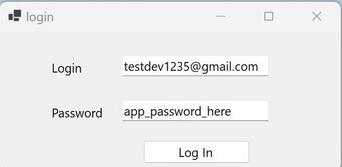
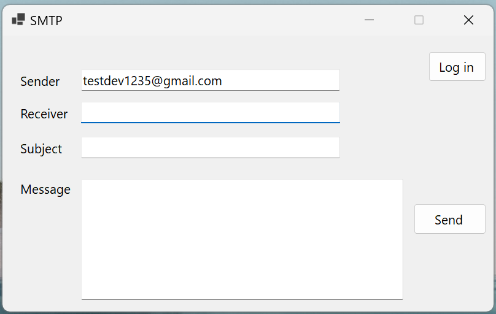

### SMTP Express

A gmail based mail sender that uses gmail smtp server to send the mails.

Steps to follow to send the mails

1. First clone this repo
2. Open in Visual Studio and run the code.
3. Create a gmail id if you dont have one
4. Enable 2FA and create an app password for gmail
5. Use those credentials to login the app
   

6. Fill up the datas
   

7. Click the send button
8. Congratulations, your message have been sent.

## About Project

This project is based on C# programming language and is using gmail smtp server to freely send the mails to the
